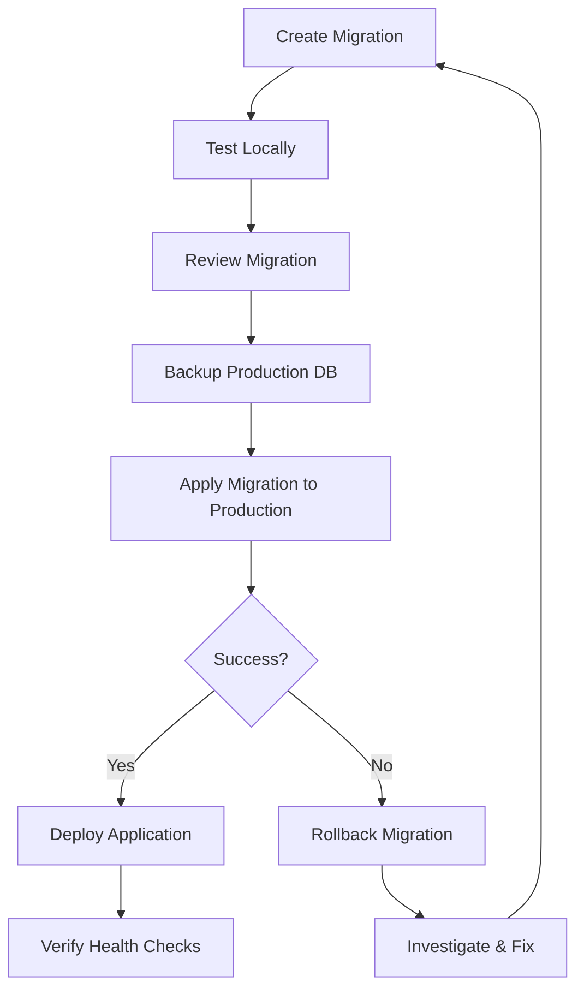

# Production Deployment Guide

## Overview

This guide covers all aspects of deploying the Inventory Management API to production, with specific focus on database initialization and migration management.

## Table of Contents

1. [Pre-Deployment Checklist](#pre-deployment-checklist)
2. [Database Migration Strategy](#database-migration-strategy)
3. [Deployment Scenarios](#deployment-scenarios)
4. [Environment Configuration](#environment-configuration)
5. [Health Checks and Monitoring](#health-checks-and-monitoring)
6. [Rollback Procedures](#rollback-procedures)
7. [Troubleshooting](#troubleshooting)

---

## Pre-Deployment Checklist

Before deploying to production:

- [ ] All tests passing (unit, integration, E2E)
- [ ] Code reviewed and approved
- [ ] Database backup created
- [ ] Migration scripts reviewed
- [ ] Environment variables configured
- [ ] Secrets properly stored (use Azure Key Vault, AWS Secrets Manager, etc.)
- [ ] Health check endpoints verified
- [ ] Rollback plan documented
- [ ] Monitoring and alerting configured
- [ ] Database connection strings validated

---

## Database Migration Strategy

### Philosophy

The application follows a **"Migrations First, Deploy Second"** strategy:

1. **Development**: Automatic migrations for rapid iteration
2. **Production**: Manual migrations for safety and control

### Production Migration Workflow



---

## Deployment Scenarios

### Scenario 1: Fresh Installation (New Environment)

**Use Case**: First-time deployment to a new environment

#### Steps:

1. **Create Database** (if not exists):
   ```bash
   # On PostgreSQL server
   createdb -U postgres inventorydb
   ```

2. **Set Environment to Production**:
   ```bash
   export ASPNETCORE_ENVIRONMENT=Production
   ```

3. **Apply All Migrations**:
   ```bash
   cd /path/to/ASP.NET-Core-Inventory-Management-API-

   dotnet ef database update \
     --project src/InventoryAPI.Infrastructure \
     --startup-project src/InventoryAPI.Api \
     --context ApplicationDbContext
   ```

4. **Verify Migration Status**:
   ```bash
   dotnet ef migrations list \
     --project src/InventoryAPI.Infrastructure \
     --startup-project src/InventoryAPI.Api
   ```

5. **Start Application**:
   ```bash
   dotnet run --project src/InventoryAPI.Api --configuration Release
   ```

6. **Verify Health**:
   ```bash
   curl http://localhost:5000/api/v1/health
   curl http://localhost:5000/api/v1/database/status
   ```

**Expected Output**:
- Application starts successfully
- Health check returns `Healthy`
- Database status shows 0 pending migrations

---

### Scenario 2: Updating Existing Deployment

**Use Case**: Rolling out new version with database changes

#### Steps:

1. **Backup Current Database**:
   ```bash
   # PostgreSQL backup
   pg_dump -U inventoryuser -d inventorydb > backup_$(date +%Y%m%d_%H%M%S).sql
   ```

2. **Stop Application** (optional, depends on migration):
   ```bash
   # For Docker
   docker-compose stop api

   # For systemd
   sudo systemctl stop inventory-api
   ```

3. **Review Pending Migrations**:
   ```bash
   dotnet ef migrations list \
     --project src/InventoryAPI.Infrastructure \
     --startup-project src/InventoryAPI.Api
   ```

4. **Apply Migrations**:
   ```bash
   dotnet ef database update \
     --project src/InventoryAPI.Infrastructure \
     --startup-project src/InventoryAPI.Api
   ```

5. **Verify Migration Success**:
   ```bash
   # Check for errors in output
   # Verify tables/columns exist in database
   psql -U inventoryuser -d inventorydb -c "\dt"
   ```

6. **Deploy New Application Version**:
   ```bash
   # Pull latest code
   git pull origin main

   # Build
   dotnet build --configuration Release

   # Start application
   docker-compose up -d api
   # OR
   sudo systemctl start inventory-api
   ```

7. **Monitor Startup**:
   ```bash
   # Watch logs
   docker-compose logs -f api
   # OR
   sudo journalctl -u inventory-api -f
   ```

8. **Verify Health**:
   ```bash
   # Basic health check
   curl http://localhost:5000/api/v1/health

   # Detailed database status
   curl http://localhost:5000/api/v1/database/status | jq
   ```

**Expected Output**:
```json
{
  "status": "Healthy",
  "canConnect": true,
  "currentMigration": "20250110154530_YourLatestMigration",
  "totalMigrationsApplied": 5,
  "pendingMigrationsCount": 0,
  "responseTimeMs": 45,
  "timestamp": "2025-01-10T15:45:30Z"
}
```

---

### Scenario 3: Zero-Downtime Deployment

**Use Case**: Critical production system requiring no downtime

#### Strategy: Blue-Green Deployment

1. **Ensure Migration is Backward Compatible**:
   - Add new columns as nullable
   - Don't drop columns until next release
   - Don't rename tables/columns in same release as code changes

2. **Apply Migration to Live Database** (both versions can use it):
   ```bash
   dotnet ef database update
   ```

3. **Deploy New Version (Green)**:
   ```bash
   # Start new version on different port
   docker run -d -p 5001:80 --name inventory-api-green \
     -e ASPNETCORE_ENVIRONMENT=Production \
     inventory-api:latest
   ```

4. **Verify Green Deployment**:
   ```bash
   curl http://localhost:5001/api/v1/health
   ```

5. **Switch Traffic** (load balancer/reverse proxy):
   ```bash
   # Update nginx/traefik/etc to point to green
   # Or update Docker port mapping
   ```

6. **Monitor for Issues**:
   ```bash
   # Watch logs for 15-30 minutes
   docker logs -f inventory-api-green
   ```

7. **Stop Old Version (Blue)** if successful:
   ```bash
   docker stop inventory-api-blue
   docker rm inventory-api-blue
   ```

---

### Scenario 4: Database Connection Failure

**Use Case**: Database unavailable during deployment

#### What Happens:

**Development**:
- Application logs warnings
- Starts anyway (degraded mode)
- Retries connection automatically

**Production**:
- Application FAILS to start (fail-fast)
- Logs clear error message
- Prevents serving requests with broken DB

#### Resolution:

1. **Check Database Status**:
   ```bash
   # PostgreSQL
   pg_isready -h localhost -p 5432 -U inventoryuser

   # Docker
   docker-compose ps postgres
   ```

2. **Check Connection String**:
   ```bash
   # Verify environment variables
   echo $ConnectionStrings__DefaultConnection
   ```

3. **Check Network/Firewall**:
   ```bash
   # Test connectivity
   telnet postgres-server 5432
   nc -zv postgres-server 5432
   ```

4. **Review Logs**:
   ```bash
   # Application logs
   cat logs/inventory-api-*.txt

   # Database logs
   docker logs postgres
   ```

---

## Environment Configuration

### Required Environment Variables

```bash
# Application
ASPNETCORE_ENVIRONMENT=Production
ASPNETCORE_URLS=http://+:80

# Database
ConnectionStrings__DefaultConnection="Host=prod-db.example.com;Port=5432;Database=inventorydb;Username=inventoryuser;Password=***"

# JWT (CRITICAL: Use strong secrets!)
JwtSettings__SecretKey="YourProductionSecretKeyMustBeAtLeast32CharactersLong!"
JwtSettings__Issuer="InventoryAPI"
JwtSettings__Audience="InventoryAPIUsers"
JwtSettings__ExpiryMinutes=60
JwtSettings__RefreshTokenExpiryDays=7
```

### Security Best Practices

1. **Never commit secrets to source control**
2. **Use secret management services**:
   - Azure Key Vault
   - AWS Secrets Manager
   - HashiCorp Vault
   - Docker Secrets

3. **Rotate secrets regularly**

4. **Use different secrets per environment**

---

## Health Checks and Monitoring

### Health Check Endpoints

| Endpoint | Purpose | Auth | Response Time |
|----------|---------|------|---------------|
| `/api/v1/health` | Overall health status | None | <100ms |
| `/api/v1/database/status` | Detailed DB status | None | <500ms |
| `/api/v1/database/verify` | Admin verification | Admin | <1000ms |

### Monitoring Setup

#### Kubernetes Liveness Probe

```yaml
livenessProbe:
  httpGet:
    path: /api/v1/health
    port: 80
  initialDelaySeconds: 30
  periodSeconds: 10
  timeoutSeconds: 5
  failureThreshold: 3
```

#### Kubernetes Readiness Probe

```yaml
readinessProbe:
  httpGet:
    path: /api/v1/database/status
    port: 80
  initialDelaySeconds: 10
  periodSeconds: 5
  timeoutSeconds: 3
  failureThreshold: 2
```

#### Docker Compose Health Check

```yaml
services:
  api:
    healthcheck:
      test: ["CMD", "curl", "-f", "http://localhost/api/v1/health"]
      interval: 30s
      timeout: 10s
      retries: 3
      start_period: 40s
```

### Monitoring Queries

```bash
# Check health
curl http://your-api.com/api/v1/health

# Get detailed status (JSON)
curl http://your-api.com/api/v1/database/status | jq

# Check for pending migrations
curl http://your-api.com/api/v1/database/status | jq '.pendingMigrationsCount'

# Verify with admin token
curl -H "Authorization: Bearer $ADMIN_TOKEN" \
  http://your-api.com/api/v1/database/verify | jq
```

---

## Rollback Procedures

### Scenario 1: Migration Failure

If migration fails during application:

1. **Migration already has transaction rollback** (automatic)
2. **Check error logs** for specific issue
3. **Fix migration** and redeploy
4. **Don't manually edit database** to "fix" it

### Scenario 2: Application Deployed, Migration Causes Issues

If app is deployed but migration causes runtime issues:

#### Option A: Rollback Migration (Recommended for non-destructive changes)

```bash
# 1. Stop application
docker-compose stop api

# 2. Restore database backup
pg_restore -U inventoryuser -d inventorydb backup_20250110.sql

# 3. Deploy previous application version
git checkout previous-tag
docker-compose up -d --build api

# 4. Verify health
curl http://localhost:5000/api/v1/health
```

#### Option B: Rollforward (Fix forward)

```bash
# 1. Create fix migration
dotnet ef migrations add FixIssue \
  --project src/InventoryAPI.Infrastructure \
  --startup-project src/InventoryAPI.Api

# 2. Apply fix
dotnet ef database update

# 3. Redeploy
docker-compose up -d --build api
```

### Scenario 3: Complete Disaster Recovery

```bash
# 1. Stop all services
docker-compose down

# 2. Restore database from backup
dropdb -U postgres inventorydb
createdb -U postgres inventorydb
pg_restore -U postgres -d inventorydb full_backup.sql

# 3. Reset to known good state
git checkout last-known-good-tag

# 4. Rebuild and restart
docker-compose up -d --build

# 5. Verify
curl http://localhost:5000/api/v1/health
```

---

## Troubleshooting

### Issue: "Database has pending migrations" in Production

**Symptom**: Application fails to start with error about pending migrations

**Cause**: Migrations not applied before deployment

**Resolution**:
```bash
# Apply migrations manually
dotnet ef database update \
  --project src/InventoryAPI.Infrastructure \
  --startup-project src/InventoryAPI.Api

# Restart application
docker-compose restart api
```

---

### Issue: Connection Timeout

**Symptom**: "Connection timeout" in logs

**Possible Causes**:
1. Database not running
2. Firewall blocking connection
3. Wrong connection string
4. Connection pool exhausted

**Resolution**:
```bash
# Check database
pg_isready -h your-db-host -p 5432

# Check connection from app server
telnet your-db-host 5432

# Review connection string
echo $ConnectionStrings__DefaultConnection

# Check active connections
psql -U inventoryuser -d inventorydb -c "SELECT count(*) FROM pg_stat_activity;"
```

---

### Issue: Health Check Returns "Degraded"

**Symptom**: Health check shows `Degraded` status

**Cause**: Pending migrations detected

**Resolution**:
```bash
# Check what migrations are pending
curl http://your-api.com/api/v1/database/status | jq '.pendingMigrationsCount'

# Apply migrations
dotnet ef database update
```

---

### Issue: Migration Applied But Application Can't Connect

**Symptom**: Migrations successful but app shows connection errors

**Possible Causes**:
1. Different connection strings used
2. Permissions issue
3. SSL/TLS configuration mismatch

**Resolution**:
```bash
# Verify migration was applied
psql -U inventoryuser -d inventorydb -c "\dt"

# Test connection with same credentials
psql -U inventoryuser -d inventorydb -c "SELECT 1;"

# Check PostgreSQL logs
docker logs postgres
```

---

## Automated Deployment Scripts

See the `scripts/` directory for:

- `migrate-database.sh` - Apply migrations
- `backup-database.sh` - Create database backup
- `rollback-migration.sh` - Rollback to specific migration
- `health-check.sh` - Verify deployment health
- `deploy-production.sh` - Complete deployment workflow

---

## CI/CD Integration

### GitHub Actions Example

```yaml
name: Deploy to Production

on:
  push:
    tags:
      - 'v*'

jobs:
  deploy:
    runs-on: ubuntu-latest
    steps:
      - uses: actions/checkout@v3

      - name: Setup .NET
        uses: actions/setup-dotnet@v3
        with:
          dotnet-version: '8.0.x'

      - name: Install EF Core Tools
        run: dotnet tool install --global dotnet-ef

      - name: Backup Database
        run: |
          pg_dump ${{ secrets.DB_CONNECTION }} > backup.sql

      - name: Apply Migrations
        run: |
          dotnet ef database update \
            --project src/InventoryAPI.Infrastructure \
            --startup-project src/InventoryAPI.Api \
            --connection "${{ secrets.DB_CONNECTION }}"

      - name: Build and Deploy
        run: |
          docker build -t inventory-api:${{ github.ref_name }} .
          docker push inventory-api:${{ github.ref_name }}

      - name: Health Check
        run: |
          curl -f http://your-api.com/api/v1/health || exit 1
```

---

## Best Practices Summary

✅ **Always backup before migrations**
✅ **Test migrations in staging first**
✅ **Review migration SQL before applying**
✅ **Apply migrations before deploying app**
✅ **Monitor health checks after deployment**
✅ **Keep rollback plan ready**
✅ **Use connection retry logic** (already implemented)
✅ **Fail fast in production** (already implemented)
✅ **Log everything** (already implemented)
✅ **Never modify production DB manually**

---

## Support and Contacts

- **Documentation**: See `/docs` directory
- **Issues**: GitHub Issues
- **Emergency**: [Your on-call rotation]

---

**Last Updated**: 2025-01-10
**Version**: 1.0.0
